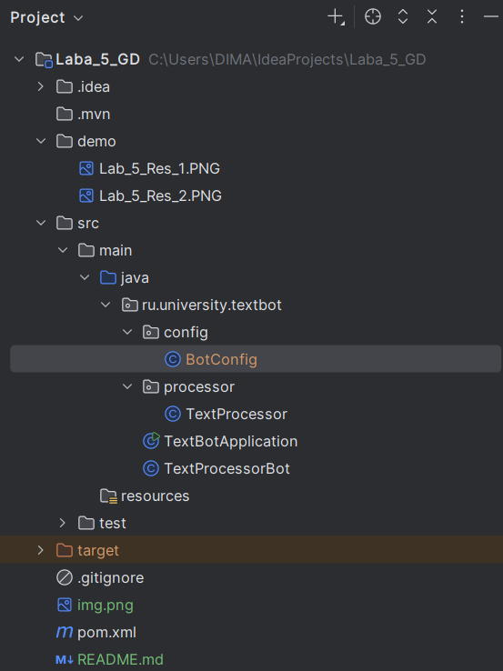
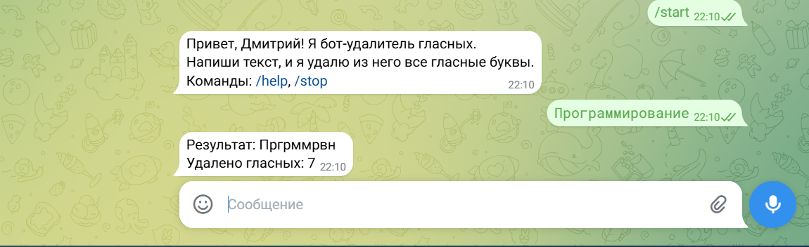

# <p align="center">**`Laba_5_TG_BOT`**</p>
<p align="center">
  
  
  
  
</p>

<p align="center">
  <b>Telegram-бот, удаляющий гласные буквы из сообщений</b><br>
  Вариант 5
</p>

## Об авторе

| Поле | Значение |
|------|----------|
| ФИО | Глушков Дмитрий Николаевич |
| Группа | бОИС-241 |
| ВУЗ | ВГТУ |
| Вариант | 5 |
| Дата выполнения | 2026 г. |

## Цели работы

1. Изучить архитектуру взаимодействия клиент-сервер в контексте Telegram-ботов
2. Освоить базовые принципы работы с библиотекой для Telegram Bot API
3. Реализовать обработку входящих текстовых сообщений с помощью классов String и StringBuilder
4. Настроить логирование событий и обработку ошибок
5. Подготовить инфраструктуру для создания более сложных Telegram-приложений

## 1. О проекте

Проект представляет собой Telegram-бота на Java, взаимодействующего с пользователем через Long Polling. Бот принимает текстовые сообщения, обрабатывает их по заданному алгоритму и возвращает результат. Индивидуальное задание (Вариант 5): удаление всех гласных букв из текста (а, е, ё, и, о, у, ы, э, ю, я).

## 2. Возможности

1. Приём текстовых сообщений от пользователя
2. Удаление гласных букв (русские, строчные и заглавные)
3. Вывод результирующей строки и количества удалённых символов
4. Поддержка служебных команд: `/start`, `/help`, `/stop`
5. Логгирование всех запросов и ответов в `System.err`

## 3. Команды бота

| Команда | Назначение |
|:-------:|------------|
| `/start` | Запуск бота, приветственное сообщение |
| `/help` | Вывод справочной информации |
| `/stop` | Завершение сеанса, прощание с пользователем |
| любой текст | Обработка сообщения: удаление гласных |

## 4. Пример работы

| Ввод | Вывод |
|------|-------|
| `Программирование` | `Результат: Пргрммвн` |
| | `Удалено гласных: 7` |
| `Привет` | `Результат: Првт` |
| | `Удалено гласных: 2` |

## 5. Описание реализации

Бот построен на базе библиотеки `telegrambots` версии 7.10.0. Взаимодействие с серверами Telegram осуществляется через механизм Long Polling. Каждое входящее обновление (Update) содержит объект Message, из которого извлекается текст сообщения, идентификатор чата и информация об отправителе.

Обработка текста выполняется в классе `TextProcessor`. Алгоритм проходит по каждому символу исходной строки и проверяет его наличие в наборе гласных букв. Если символ не является гласным, он добавляется в объект `StringBuilder`. Такой подход эффективнее конкатенации строк через оператор `+`, так как не создаёт промежуточных объектов String.

Логирование реализовано через стандартный поток ошибок `System.err`, что позволяет отделить логи от основного вывода программы.

## 6. Технологии

| Технология | Назначение |
|:----------:|------------|
| Java 17 | Язык программирования |
| Maven | Система сборки и управления зависимостями |
| Telegram Bot API | HTTP-интерфейс взаимодействия с Telegram |
| telegrambots 7.10.0 | Java-библиотека для работы с Bot API |
| Long Polling | Механизм получения обновлений от сервера |
| SLF4J | Фреймворк логирования |

## 7. Структура проекта

## 8. Схема классов

| Класс | Роль |
|-------|------|
| TextBotApplication | Запуск приложения, регистрация бота |
| TextProcessorBot | Обработка входящих сообщений, отправка ответов |
| TextProcessor | Алгоритм удаления гласных (StringBuilder) |
| BotConfig | Хранение конфигурационных данных |

## 9. Сложности и интересные факты

В процессе разработки возникли следующие сложности:

1. Блокировка Telegram API на территории России. Прямые запросы к `api.telegram.org` блокируются провайдерами, что потребовало использования системного VPN-клиента (Windscribe) для обеспечения доступа к серверам Telegram.

2. Подбор публичных HTTP и SOCKS5 прокси. Бесплатные публичные прокси-серверы работают нестабильно и часто перестают отвечать в течение нескольких минут, что делает их непригодными для длительной работы бота.

3. Несовместимость MTProto-прокси с Bot API. Прокси, используемые в клиентских приложениях Telegram, не подходят для работы с Bot API, так как используют другой протокол взаимодействия.

4. Версионная совместимость библиотек. Версия `telegrambots` 9.2.1 оказалась нестабильной в связке с SLF4J. Решение: переход на версию 7.10.0 и добавление зависимости `slf4j-simple`.

5. При работе через VPN на телефоне с раздачей интернета на ноутбук трафик Java-приложения не проходил через VPN-туннель. Потребовалась установка VPN-клиента непосредственно на компьютер.

## 10. Запуск проекта

1. Клонирование репозитория:
```bash
git clone https://github.com/Dimagluschkow322/Laba_5_TG_BOT.git
cd Laba_5_TG_BOT
```

---

## 11. Демонстрация работы

На рисунке 1 изображена консоль IntelliJ IDEA при успешном запуске бота. Отображается сообщение о запуске, а также логи обработки входящих сообщений и отправки ответов.


<span style="color:blue">*Рисунок 1 - Консоль при запуске бота*</span>

На рисунке 2 изображена переписка с ботом в Telegram. Пользователь отправляет команду `/start` и текст "Программирование", бот возвращает результат обработки с указанием количества удалённых гласных.



<span style="color:green">*Рисунок 2 - Переписка с ботом в Telegram*
</span>
## 12. Вывод

В результате выполнения лабораторной работы был создан Telegram-бот, реализующий алгоритм удаления гласных букв из текстовых сообщений. Освоены принципы клиент-серверного взаимодействия через Long Polling, получены практические навыки работы с библиотекой `telegrambots`, классами `String` и `StringBuilder`. Реализована система логирования и обработки ошибок. Подготовлена инфраструктура для дальнейшей разработки более сложных Telegram-приложений.
